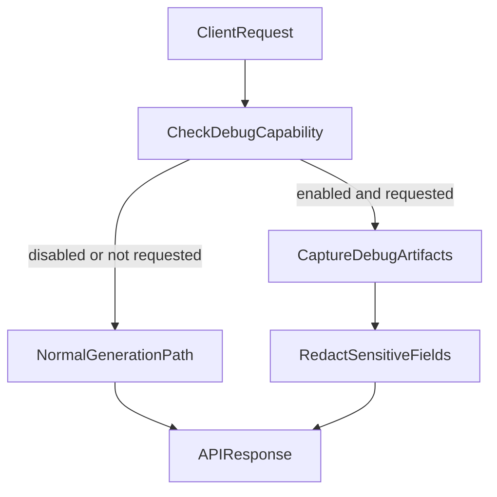

# ICO Workflow Generator - System Design Document

## Executive Summary

The **ICO Workflow Generator** is a web application that uses artificial intelligence (GPT-4.1) to automatically create Cisco Intersight Cloud Orchestrator (ICO) workflows from natural language descriptions. Users describe what automation they need in plain English, and the system generates the required JSON configuration files that can be imported directly into Intersight.

---

## Table of Contents

1. [The Problem It Solves](#the-problem-it-solves)
2. [How It Works](#how-it-works)
3. [Is This RAG? (No, It's Few-Shot Learning)](#is-this-rag-no-its-few-shot-learning)
4. [Why MDS Workflows Work (And Others Don't)](#why-mds-workflows-work-and-others-dont)
5. [Source Workflow JSON References](#source-workflow-json-references)
6. [System Architecture](#system-architecture)
7. [The AI Instruction System](#the-ai-instruction-system)
8. [Post-Processing Pipeline](#post-processing-pipeline)
9. [Authentication Flow](#authentication-flow)
10. [Debug Mode (Safe Inner Workings)](#debug-mode-safe-inner-workings)
11. [Current Limitations](#current-limitations)
12. [Recommendations for Improvement](#recommendations-for-improvement)
13. [Dual-Path Template Architecture](#dual-path-template-architecture)
14. [Template Provenance and Governance](#template-provenance-and-governance)
15. [Customer-Beta Product Roadmap](#customer-beta-product-roadmap)
16. [Glossary](#glossary)

---

## The Problem It Solves

### Before This Tool
- Engineers had to manually write complex JSON files (often 500-2000+ lines)
- Required deep knowledge of ICO's specific JSON schema
- Error-prone and time-consuming
- Steep learning curve for new team members

### After This Tool
- Describe what you need in plain English
- AI generates the complete JSON configuration
- Import directly into Intersight
- Reduces workflow creation time from hours to minutes

---

## How It Works

```
┌─────────────────────────────────────────────────────────────────────────┐
│                        ICO WORKFLOW GENERATOR                           │
├─────────────────────────────────────────────────────────────────────────┤
│                                                                         │
│   ┌──────────────┐     ┌──────────────┐     ┌──────────────────────┐   │
│   │              │     │              │     │                      │   │
│   │  User Input  │────▶│  GPT-4.1     │────▶│  Post-Processing     │   │
│   │  (JIRA Text) │     │  (Cisco AI)  │     │  (Fixes & Validation)│   │
│   │              │     │              │     │                      │   │
│   └──────────────┘     └──────────────┘     └──────────────────────┘   │
│         │                     │                        │               │
│         │                     │                        │               │
│         ▼                     ▼                        ▼               │
│   ┌──────────────┐     ┌──────────────┐     ┌──────────────────────┐   │
│   │ "Create a    │     │ Sample MDS   │     │  Valid ICO JSON      │   │
│   │ workflow to  │     │ Workflows    │     │  Ready for Import    │   │
│   │ manage MDS   │     │ (Examples)   │     │                      │   │
│   │ ports..."    │     │              │     │                      │   │
│   └──────────────┘     └──────────────┘     └──────────────────────┘   │
│                                                                         │
└─────────────────────────────────────────────────────────────────────────┘
```

---

## Dual-Path Template Architecture

The product currently supports **two generation paths**. This is intentional and helps with reliability during rollout.

| Path | Main Files | How It Works | Best Use |
|------|------------|--------------|----------|
| **LLM Few-Shot Path** | `ico-workflow-generator/app/llm_generator.py` | Uses embedded `SAMPLE_TASK_DEFINITION`, `SAMPLE_BATCH_EXECUTOR`, and `SAMPLE_WORKFLOW` as in-context examples for GPT-4.1 | Flexible workflow creation from plain-language requirements |
| **Rule-Based Template Path** | `ico-workflow-generator/workflow_templates/*`, `ico-workflow-generator/rules/mappings.yaml`, `ico-workflow-generator/app/rule_engine.py` | Matches parsed requirements to prebuilt Python workflow modules | Deterministic fallback and known templates |

### Why Both Paths Exist

- The LLM path provides broader generation capability and better language understanding.
- The rule-based path provides deterministic behavior and a fallback if LLM is unavailable.
- Keeping both paths helps product hardening and gradual adoption for customers.

### Template Definitions In Today’s Codebase

1. **LLM sample templates (few-shot examples):**
   - `SAMPLE_TASK_DEFINITION`
   - `SAMPLE_BATCH_EXECUTOR`
   - `SAMPLE_WORKFLOW`
2. **Rule-based templates (Python modules):**
   - `workflow_templates.mds.add_host_to_san`
   - `workflow_templates.mds.save_config`
   - `workflow_templates.compute.toggle_locator_led`
   - `workflow_templates.compute.get_server_inventory`
3. **ICO runtime string templates inside JSON:**
   - Go-template syntax such as `{{.global.task.input.param}}`

---

## Template Provenance and Governance

### Provenance: Where Templates Came From

Templates and few-shot examples were derived from known-good ICO exports and then refined through import validation feedback:

- `MDS_VLAN_Management_Tasks_and_Workflow.json`
- `MDS_Save_Configuration_Task_and_Workflow.json`
- `Workflow_Example-AddNewHosttoSAN_11-23-2022.json`
- `Toggle_Locator_LED_Task.json`

### Governance: How New Templates Should Be Added

For customer-beta quality, add templates with a controlled process:

1. **Source capture**: capture workflow/task JSON from Intersight export or validated internal sample.
2. **Normalization**: remove environment-specific identifiers and sanitize labels/names.
3. **Validation**: run local validator plus import verification in a beta test tenant.
4. **Cataloging**: classify by domain (`mds`, `compute`, `storage`, `generic-webapi`).
5. **Promotion**: include as LLM context example (or rule template) only after passing checks.
6. **Versioning**: track template version, source, validation date, and owner.

### Minimum Metadata Per Template Artifact

| Field | Description |
|------|-------------|
| `template_id` | Stable identifier |
| `source_type` | `intersight_export`, `repo_file`, `uploaded_file` |
| `source_reference` | File path, URL, or repo + ref |
| `domain` | `mds`, `compute`, `storage`, `generic` |
| `validation_status` | `draft`, `validated`, `deprecated` |
| `validated_on` | Date of last verification |
| `owner` | Team or maintainer |

---

## Customer-Beta Product Roadmap

### Product Direction

The next product milestone is **customer beta**, focused on expanding context inputs safely and validating quality end-to-end.

### Planned Beta Features

1. **Context ingestion**
   - Ad-hoc user upload of ICO JSON workflow/task exports
   - GitHub public repository ingestion for workflow examples
2. **Context-aware generation**
   - User-selected context artifacts added to LLM prompt within token budget
   - Context provenance returned with every generation response
3. **Reliability**
   - Automated test suite with unit, route, and regression tests
   - CI checks on every commit

### Planned Post-Beta Connectors

- GitHub private repositories via OAuth
- Intersight catalog/workflow discovery via OAuth
- Optional semantic retrieval (RAG) at larger scale

---

## Is This RAG? (No, It's Few-Shot Learning)

### What is RAG (Retrieval Augmented Generation)?

RAG is a technique where:
1. User asks a question
2. System **searches** a database to find relevant documents
3. Retrieved documents are sent to the LLM along with the question
4. LLM generates an answer using the retrieved context

```
┌─────────────────────────────────────────────────────────────────────────┐
│                         TRUE RAG ARCHITECTURE                           │
├─────────────────────────────────────────────────────────────────────────┤
│                                                                         │
│   ┌──────────┐     ┌──────────────┐     ┌──────────────┐               │
│   │  User    │────▶│   Vector     │────▶│  Retrieve    │               │
│   │  Query   │     │   Database   │     │  Top-K Docs  │               │
│   └──────────┘     │  (Embeddings)│     └──────────────┘               │
│                    └──────────────┘            │                        │
│                                                │                        │
│                                                ▼                        │
│   ┌──────────────────────────────────────────────────────────┐         │
│   │                         LLM                               │         │
│   │   Query + Retrieved Documents ──▶ Generated Answer        │         │
│   └──────────────────────────────────────────────────────────┘         │
│                                                                         │
└─────────────────────────────────────────────────────────────────────────┘
```

### What We Actually Use: Few-Shot Learning (In-Context Learning)

Our system uses a simpler but effective technique called **Few-Shot Learning**:

1. Examples are **hardcoded** in the system prompt (not retrieved)
2. The **same examples** are sent to the LLM for every request
3. No vector database, no embeddings, no retrieval step

```
┌─────────────────────────────────────────────────────────────────────────┐
│                    FEW-SHOT LEARNING (What We Use)                      │
├─────────────────────────────────────────────────────────────────────────┤
│                                                                         │
│   ┌──────────────────────────────────────────────────────────┐         │
│   │                    SYSTEM PROMPT                          │         │
│   │  ┌────────────────────────────────────────────────────┐  │         │
│   │  │  "You are an ICO workflow designer..."              │  │         │
│   │  │                                                      │  │         │
│   │  │  EXAMPLE 1: TaskDefinition JSON (MDS Port Action)   │  │         │
│   │  │  EXAMPLE 2: BatchApiExecutor JSON (NX-API call)     │  │         │
│   │  │  EXAMPLE 3: WorkflowDefinition JSON (Orchestration) │  │         │
│   │  │                                                      │  │         │
│   │  │  "Follow these examples exactly..."                  │  │         │
│   │  └────────────────────────────────────────────────────┘  │         │
│   └──────────────────────────────────────────────────────────┘         │
│                              +                                          │
│   ┌──────────────────────────────────────────────────────────┐         │
│   │                     USER PROMPT                           │         │
│   │  "Create a workflow to manage MDS ports..."               │         │
│   └──────────────────────────────────────────────────────────┘         │
│                              │                                          │
│                              ▼                                          │
│   ┌──────────────────────────────────────────────────────────┐         │
│   │                      GPT-4.1                              │         │
│   │         Generates JSON following the examples             │         │
│   └──────────────────────────────────────────────────────────┘         │
│                                                                         │
└─────────────────────────────────────────────────────────────────────────┘
```

### Key Differences

| Aspect | RAG | Few-Shot Learning (Our Approach) |
|--------|-----|----------------------------------|
| **Retrieval** | Dynamic - searches for relevant docs | None - examples are static |
| **Database** | Vector database required | No database needed |
| **Examples** | Different for each query | Same for every query |
| **Scalability** | Can handle thousands of documents | Limited by context window size |
| **Complexity** | Higher - needs embeddings, search | Lower - just prompt engineering |

### How Can GPT-4.1 "Understand" Without RAG?

**This is a common misconception.** The Cisco Chat AI endpoint only provides a "completions" API, but this doesn't mean it's not context-aware. Here's why:

#### How LLM Completions Actually Work

```
┌─────────────────────────────────────────────────────────────────────────┐
│                    LLM COMPLETION REQUEST                               │
├─────────────────────────────────────────────────────────────────────────┤
│                                                                         │
│   POST /chat/completions                                                │
│   {                                                                     │
│     "messages": [                                                       │
│       {                                                                 │
│         "role": "system",                                               │
│         "content": "You are an ICO expert... [EXAMPLES HERE]..."        │  ◀── Context
│       },                                                                │
│       {                                                                 │
│         "role": "user",                                                 │
│         "content": "Create a workflow for MDS port management"         │  ◀── Query
│       }                                                                 │
│     ]                                                                   │
│   }                                                                     │
│                                                                         │
└─────────────────────────────────────────────────────────────────────────┘
                                    │
                                    ▼
┌─────────────────────────────────────────────────────────────────────────┐
│                         GPT-4.1 PROCESSING                              │
├─────────────────────────────────────────────────────────────────────────┤
│                                                                         │
│   1. Receives ENTIRE context (system + user messages)                   │
│   2. Transformer architecture processes ALL tokens together             │
│   3. "Attention" mechanism connects query to examples                   │
│   4. Generates output that follows patterns from examples               │
│                                                                         │
│   This is NOT retrieval - it's pattern matching and generation          │
│   based on the transformer's training on billions of text examples.     │
│                                                                         │
└─────────────────────────────────────────────────────────────────────────┘
```

#### The Magic: Transformer Attention

GPT-4.1 uses a **transformer architecture** that can:

1. **See the entire context at once** - All examples and the user query are processed together
2. **Identify patterns** - It recognizes "this JSON structure appears in the examples"
3. **Apply patterns** - It generates new JSON following the same structure
4. **Substitute values** - It replaces example values with values from the user's request

**This is why "completions" doesn't mean "dumb"** - the model still processes context intelligently.

### Could We Add RAG to Improve This?

Yes! A future improvement could:

1. **Embed all workflow JSONs** in a vector database
2. **Search for relevant examples** based on the user's query
3. **Include only relevant examples** in the prompt

This would allow us to support many more workflow types without exceeding the context window limit.

---

## Why MDS Workflows Work (And Others Don't)

### The Key Insight: "Teaching by Example"

The system uses **few-shot learning** - we teach the AI by showing it real examples.

| Aspect | MDS Workflows | Other Workflows |
|--------|---------------|-----------------|
| **Training Examples** | 3 complete, real MDS workflow samples embedded in the AI's instructions | No examples provided |
| **Domain Knowledge** | AI sees exact JSON structure for MDS switches, NX-API calls, port management | AI must "guess" the structure |
| **API Endpoints** | Examples show `/ins` endpoint for NX-API | AI invents non-existent endpoints |
| **Success Rate** | High - AI follows the pattern | Low - AI hallucinates features |

### The Samples That Make MDS Work

The system includes three hardcoded example workflows in `ico-workflow-generator/app/llm_generator.py`:

1. **SAMPLE_TASK_DEFINITION** - Shows how to define an MDS port action task
2. **SAMPLE_BATCH_EXECUTOR** - Shows how to call the MDS NX-API (`/ins` endpoint)
3. **SAMPLE_WORKFLOW** - Shows how to orchestrate multiple tasks

When users ask for MDS-related workflows:
- The AI **copies the exact JSON structure** from these examples
- It **substitutes specific values** (port names, VSAN IDs, etc.)
- It **follows proven patterns** that are known to work

When users ask for non-MDS workflows:
- The AI **has no examples** to follow
- It **invents features** that don't exist in ICO (like `ExpressionEvaluator`)
- It **uses incorrect syntax** (like `array[string]` instead of valid types)

---

## Source Workflow JSON References

The following workflow JSON files exist in the repository and serve as reference material:

### MDS (Multilayer Director Switch) Workflows

| File | Description | Lines | Used in System Prompt? |
|------|-------------|-------|------------------------|
| `MDS_VLAN_Management_Tasks_and_Workflow.json` | Complete VLAN management workflow with create, delete, show commands | ~2100 | No (too large) |
| `MDS_Save_Configuration_Task_and_Workflow.json` | Save running config to startup config | ~300 | No |
| `Workflow_Example-AddNewHosttoSAN_11-23-2022.json` | Add new host to SAN zoning | ~500 | No |

### Compute (Server) Workflows

| File | Description | Lines | Used in System Prompt? |
|------|-------------|-------|------------------------|
| `Toggle_Locator_LED_Task.json` | Toggle server locator LED | ~314 | No |
| `Toggle_Locator_LED_Task-ver7.json` | Version 7 of locator LED task | ~270 | No |
| `Toggle_Locator_LED_Task-ver8.json` | Version 8 of locator LED task | ~270 | No |
| `Toggle_Locator_LED_Task-ver9.json` | Version 9 of locator LED task | ~270 | No |
| `GetServerInventory_task.json` | Get server inventory data | ~200 | No |
| `WF_to_set_the_Locator_LED.json` | Workflow to set locator LED | ~200 | No |
| `WF_to_set_the_Locator_LED_ver1.json` | Version 1 of LED workflow | ~200 | No |
| `WF_to_set_the_Locator_LED_ver3.json` | Version 3 of LED workflow | ~200 | No |

### What's Actually Used in the System Prompt

Currently, **only simplified MDS examples** are embedded in the system prompt (see `llm_generator.py`):

```
SAMPLE_TASK_DEFINITION    → MDS Port Admin Action (simplified)
SAMPLE_BATCH_EXECUTOR     → MDS NX-API call to /ins endpoint (simplified)  
SAMPLE_WORKFLOW           → MDS Port Management workflow (simplified)
```

These are **not** loaded from the JSON files above - they are **hardcoded** in Python as dictionaries.

### Opportunity: Use the JSON Files

The JSON files in the repository could be loaded dynamically to expand the AI's knowledge:

```python
# Future improvement: Load examples dynamically
import json

with open('Toggle_Locator_LED_Task.json') as f:
    compute_example = json.load(f)

# Include in system prompt based on user's query type
```

---

## System Architecture

### Component Diagram

```
┌─────────────────────────────────────────────────────────────────────────┐
│                           WEB BROWSER                                   │
│                    (http://localhost:5080)                              │
└─────────────────────────────────────────────────────────────────────────┘
                                    │
                                    ▼
┌─────────────────────────────────────────────────────────────────────────┐
│                         FLASK WEB SERVER                                │
│                           (run.py)                                      │
├─────────────────────────────────────────────────────────────────────────┤
│                                                                         │
│  ┌─────────────────┐  ┌─────────────────┐  ┌─────────────────┐         │
│  │    routes.py    │  │   llm_client.py │  │ llm_generator.py│         │
│  │   (API Layer)   │  │ (Auth & API)    │  │  (AI Logic)     │         │
│  └─────────────────┘  └─────────────────┘  └─────────────────┘         │
│           │                    │                    │                   │
│           │                    │                    │                   │
│           ▼                    ▼                    ▼                   │
│  ┌─────────────────┐  ┌─────────────────┐  ┌─────────────────┐         │
│  │  Handles HTTP   │  │ OAuth2 Token    │  │ System Prompt   │         │
│  │  Requests       │  │ Management      │  │ + Examples      │         │
│  │  /generate/llm  │  │                 │  │ + Post-process  │         │
│  └─────────────────┘  └─────────────────┘  └─────────────────┘         │
│                                                                         │
└─────────────────────────────────────────────────────────────────────────┘
                                    │
                                    ▼
┌─────────────────────────────────────────────────────────────────────────┐
│                      CISCO CHAT AI (GPT-4.1)                            │
│               https://chat-ai.cisco.com/openai/...                      │
│                                                                         │
│   ┌─────────────────────────────────────────────────────────────┐      │
│   │  OAuth Token Endpoint: https://id.cisco.com/oauth2/...       │      │
│   │  Chat Endpoint: .../deployments/gpt-4.1/chat/completions     │      │
│   └─────────────────────────────────────────────────────────────┘      │
│                                                                         │
└─────────────────────────────────────────────────────────────────────────┘
```

### Key Files and Their Purpose

| File | Purpose | Non-Technical Description |
|------|---------|---------------------------|
| `run.py` | Application entry point | The "start button" for the application |
| `routes.py` | Web API endpoints | Handles user requests from the browser |
| `llm_client.py` | AI connection | Talks to Cisco's GPT-4.1 AI service |
| `llm_generator.py` | AI instructions + post-processing | **The brain** - contains examples and fixes |
| `validator.py` | Quality checks | Verifies the generated JSON is valid |

---

## The AI Instruction System

The AI receives a detailed "instruction manual" (system prompt) that includes:

### 1. Role Definition
```
"You are an expert Cisco Intersight Cloud Orchestrator (ICO) workflow designer."
```

### 2. ICO Concepts Explained
- TaskDefinition structure and requirements
- BatchApiExecutor for API calls
- WorkflowDefinition for orchestration
- Variable substitution syntax (`{{.global.task.input.xxx}}` vs `${workflow.input.xxx}`)

### 3. MDS-Specific Knowledge
- NX-API endpoint (`/ins`)
- Common CLI commands (port enable, VSAN assignment, config save)
- The `ins_api` JSON body format

### 4. Complete Working Examples
Three full JSON samples embedded directly in the prompt:
- TaskDefinition (MDS Port Admin Action)
- BatchApiExecutor (NX-API call)
- WorkflowDefinition (Port Management Workflow)

### 5. Rules and Constraints
- Use CamelCase for Name fields
- Include proper error handling (OnFailure transitions)
- Always include save configuration step for MDS workflows

---

## Post-Processing Pipeline

Even with good instructions, the AI sometimes makes mistakes. The system includes automatic fixes:

```
┌────────────────┐     ┌────────────────┐     ┌────────────────┐
│  Raw AI Output │────▶│ Fix Template   │────▶│ Sanitize       │
│                │     │ Escaping       │     │ Labels         │
└────────────────┘     └────────────────┘     └────────────────┘
                                                      │
                                                      ▼
┌────────────────┐     ┌────────────────┐     ┌────────────────┐
│  Final JSON    │◀────│ Validate ICO   │◀────│ Check for      │
│  Output        │     │ Compatibility  │     │ Hallucinations │
└────────────────┘     └────────────────┘     └────────────────┘
```

### Current Fixes Applied

| Fix Function | Problem Solved | Example |
|--------------|----------------|---------|
| `_fix_template_escaping` | AI double-escapes quotes in Go templates | `\"apply\"` → `"apply"` |
| `_sanitize_labels` | AI uses invalid characters in labels | `"HTTP Headers (JSON)"` → `"HTTP Headers JSON"` |
| `_validate_ico_compatibility` | Detects invented features that don't exist | Catches `Protocol: "internal"` |

---

## Authentication Flow

```
┌─────────────┐         ┌─────────────┐         ┌─────────────┐
│   App       │         │ Cisco ID    │         │ Cisco Chat  │
│   Server    │         │ (OAuth)     │         │ AI (GPT-4.1)│
└─────────────┘         └─────────────┘         └─────────────┘
      │                        │                       │
      │  1. Request Token      │                       │
      │  (client_id, secret)   │                       │
      │───────────────────────▶│                       │
      │                        │                       │
      │  2. Access Token       │                       │
      │◀───────────────────────│                       │
      │                        │                       │
      │  3. Chat Request                               │
      │  (api-key header + appkey in body)             │
      │────────────────────────────────────────────────▶
      │                        │                       │
      │  4. Generated JSON Response                    │
      │◀────────────────────────────────────────────────
```

### Authentication Details

| Parameter | Source | Purpose |
|-----------|--------|---------|
| `CISCO_CLIENT_ID` | Environment variable | OAuth client identifier |
| `CISCO_CLIENT_SECRET` | Environment variable | OAuth client secret |
| `CISCO_APPKEY` | Environment variable | Chat AI application key |
| Token endpoint | `https://id.cisco.com/oauth2/default/v1/token` | Get access token |
| Chat endpoint | `https://chat-ai.cisco.com/openai/deployments/gpt-4.1/chat/completions` | Send prompts |

### Chat AI Request Contract Notes

- Runtime readiness check requires all three values: `CISCO_CLIENT_ID`, `CISCO_CLIENT_SECRET`, and `CISCO_APPKEY`.
- Chat calls send OAuth token in the `api-key` header.
- Chat calls send `user` as a JSON-encoded string with app key payload (for example `"{\"appkey\":\"...\"}"`).
- A regression unit test (`tests/test_llm_client.py`) protects this wire format to prevent future 422 regressions.

---

## Debug Mode (Safe Inner Workings)

The product supports a safe, optional Debug Mode to expose internal processing for troubleshooting and development.

### Enablement Model

Debug Mode uses a two-step control:

1. **Capability flag (server-side):**
   - `DEBUG_MODE_ENABLED=false` by default
   - When `false`, debug output is never returned
2. **Per-request activation:**
   - Client sends `debug=true` or header `X-Debug-Mode: true`
   - Only effective when capability is enabled

### Runtime Flow



The response is always `APIResponse`; the `debug` block is added only on the debug branch.

### Where Debug Is Shown

- **API response:** optional `debug` block in `/generate/llm`
- **UI:** Debug tab that appears only when debug payload is returned

### What Debug Contains

- Sanitized request envelope sent to LLM (messages, parameters)
- Context selection and token-budget diagnostics
- Pipeline stages performed (normalize, sanitize, compatibility checks, validation)
- Timing metadata and safe response shape metadata

### Security Controls

- Sensitive fields are redacted (`token`, `secret`, `password`, `api_key`, `authorization`, etc.)
- Debug payload is truncated to a configured max size (`DEBUG_MODE_MAX_PAYLOAD_CHARS`)
- Redaction/truncation notes are included in debug metadata

### Automatic Enum Normalization (WebApi TargetType)

To reduce import failures from LLM enum drift, generation now includes a normalization pass for `workflow.WebApi.TargetType`:

- Invalid values like `Intersight` are normalized to `Endpoint` for internal URLs.
- Schema strings like `workflow.TargetType` are normalized to valid enum values.
- External URLs are normalized to `Endpoint` for this ICO schema.
- Compatibility validation enforces allow-list values: `Endpoint`, `Local`.

### WebApi Request-Shape Normalization

To reduce malformed-import failures in generic HTTP workflows, generation also normalizes `workflow.WebApi` request shape:

- If a GET WebApi `Body` contains request metadata (for example `{"url":"...","method":"GET"}`), URL is promoted to the WebApi `Url` field and `Body` is cleared.
- `EndpointRequestType: Local` is normalized to `External` for absolute URLs and `Internal` for relative URLs.
- Absolute URLs paired with `TargetType: Local` are normalized to `TargetType: Endpoint`.
- Regression tests cover this normalization path to prevent recurrence.

### Safe-Use Guidance

- Keep Debug Mode disabled in production unless actively troubleshooting
- Never copy unredacted request traces to external channels
- Prefer short-lived enablement windows and least-privilege access

---

## Current Limitations

### Why Non-MDS Workflows Fail

| User Request | Why It Fails | Root Cause |
|--------------|--------------|------------|
| "Random text selector" | ICO doesn't have expression evaluation | AI invents `ExpressionEvaluator` endpoint |
| "Generic WebAPI call" | Complex dynamic configuration | No examples for generic WebAPI patterns |
| "Array of strings" | ICO uses `string`, `json`, `enum` types | AI uses `array[string]` which is invalid |

### The Fundamental Issue

**The AI only knows what we teach it.** Currently:
- MDS requests → Has examples → Follows patterns → **Works**
- Non-MDS requests → No examples → Guesses → **Often wrong**

---

## Recommendations for Improvement

### Short-Term (Quick Wins)

1. **Add more sample workflows** to the system prompt:
   - Server management (Locator LED, power actions)
   - Load examples from the existing JSON files in the repo

2. **Improve validation** to catch more issues before download

3. **Better error messages** explaining what went wrong and how to fix

### Medium-Term (More Effort)

4. **Dynamic example loading** based on user query:
   ```python
   if "locator led" in user_query.lower():
       examples = load_json("Toggle_Locator_LED_Task.json")
   elif "mds" in user_query.lower():
       examples = load_json("MDS_VLAN_Management.json")
   ```

5. **Category detection** - Analyze the query and select appropriate examples

### Long-Term (Significant Investment)

6. **Implement true RAG**:
   - Embed all workflow JSONs in a vector database
   - Retrieve relevant examples based on semantic similarity
   - Support unlimited workflow types

7. **Fine-tune a custom model** specifically for ICO workflow generation

8. **Interactive validation** - Connect to Intersight API to validate before download

---

## Frequently Asked Questions (Q&A)

### Q1: How big can the context window be?

**Answer:** For GPT-4.1, the context window is approximately **128,000 tokens** (roughly 96,000 words or ~400 pages of text).

To put this in perspective for our application:

| Content | Approximate Tokens | % of Context |
|---------|-------------------|--------------|
| System prompt (instructions) | ~2,000 | 1.5% |
| Sample MDS TaskDefinition | ~500 | 0.4% |
| Sample BatchApiExecutor | ~800 | 0.6% |
| Sample WorkflowDefinition | ~600 | 0.5% |
| User's JIRA text (typical) | ~500-2,000 | 0.4-1.5% |
| **Total currently used** | **~4,500-6,000** | **~4-5%** |
| **Remaining capacity** | **~122,000** | **~95%** |

**We're only using about 5% of the available context.** This means we could add 20+ more complete workflow examples without hitting limits.

---

### Q2: What happens if the context exceeds the limit?

**Answer:** There are several strategies to handle context overflow, each with trade-offs:

#### Strategy 1: Truncation (Simple but Lossy)
```
┌─────────────────────────────────────────────────────────────────┐
│  TRUNCATION                                                     │
├─────────────────────────────────────────────────────────────────┤
│                                                                 │
│  [System Prompt] + [Example 1] + [Example 2] + [...TRUNCATED]  │
│                                                                 │
│  Problem: You lose the truncated examples entirely              │
│  Use when: Older context is less important than recent          │
│                                                                 │
└─────────────────────────────────────────────────────────────────┘
```

#### Strategy 2: Summarization (Compress, Don't Lose)
```
┌─────────────────────────────────────────────────────────────────┐
│  SUMMARIZATION                                                  │
├─────────────────────────────────────────────────────────────────┤
│                                                                 │
│  Step 1: Call LLM to summarize older content                    │
│  Step 2: Use summary + recent content for final call            │
│                                                                 │
│  Example:                                                       │
│  - Original: 50 workflow examples (100K tokens)                 │
│  - Summary: "Key patterns: use /ins for MDS, include           │
│             OnFailure handlers, use CamelCase names..." (2K)    │
│                                                                 │
│  Problem: Summaries lose detail and nuance                      │
│  Use when: You need broad knowledge, not exact syntax           │
│                                                                 │
└─────────────────────────────────────────────────────────────────┘
```

#### Strategy 3: RAG - Retrieve Only What's Relevant
```
┌─────────────────────────────────────────────────────────────────┐
│  RAG (Retrieval Augmented Generation)                           │
├─────────────────────────────────────────────────────────────────┤
│                                                                 │
│  User Query: "Create MDS port workflow"                         │
│          │                                                      │
│          ▼                                                      │
│  ┌─────────────────┐                                            │
│  │ Vector Database │  Contains embeddings of 500 workflows      │
│  │  (Similarity    │                                            │
│  │   Search)       │                                            │
│  └─────────────────┘                                            │
│          │                                                      │
│          ▼                                                      │
│  Top 5 most similar workflows retrieved:                        │
│  - MDS_VLAN_Management.json (similarity: 0.92)                  │
│  - MDS_Port_Config.json (similarity: 0.89)                      │
│  - MDS_Save_Config.json (similarity: 0.85)                      │
│  ...                                                            │
│                                                                 │
│  Only these 5 go into the prompt (not all 500)                  │
│                                                                 │
│  This is the RECOMMENDED approach for scaling                   │
│                                                                 │
└─────────────────────────────────────────────────────────────────┘
```

#### Strategy 4: Hierarchical/Multi-Stage Approach
```
┌─────────────────────────────────────────────────────────────────┐
│  HIERARCHICAL APPROACH                                          │
├─────────────────────────────────────────────────────────────────┤
│                                                                 │
│  Stage 1: "Classifier" LLM call                                 │
│  ┌─────────────────────────────────────────────────────────┐   │
│  │ Input: User's JIRA text                                  │   │
│  │ Output: Category (MDS, Compute, Storage, Network, etc.)  │   │
│  └─────────────────────────────────────────────────────────┘   │
│                              │                                  │
│                              ▼                                  │
│  Stage 2: Load category-specific examples                       │
│  ┌─────────────────────────────────────────────────────────┐   │
│  │ If category = "MDS":                                     │   │
│  │     Load MDS examples (10 workflows)                     │   │
│  │ If category = "Compute":                                 │   │
│  │     Load Compute examples (10 workflows)                 │   │
│  └─────────────────────────────────────────────────────────┘   │
│                              │                                  │
│                              ▼                                  │
│  Stage 3: "Generator" LLM call with relevant examples           │
│                                                                 │
└─────────────────────────────────────────────────────────────────┘
```

#### Strategy 5: Fine-Tuning (Bake Knowledge Into Weights)
```
┌─────────────────────────────────────────────────────────────────┐
│  FINE-TUNING                                                    │
├─────────────────────────────────────────────────────────────────┤
│                                                                 │
│  Instead of putting examples in the prompt:                     │
│  Train a custom model that "knows" ICO workflow syntax          │
│                                                                 │
│  Training Data:                                                 │
│  ┌─────────────────────────────────────────────────────────┐   │
│  │ Input: "Create MDS port enable task"                     │   │
│  │ Output: <complete valid JSON>                            │   │
│  │                                                          │   │
│  │ Input: "Create server LED toggle workflow"               │   │
│  │ Output: <complete valid JSON>                            │   │
│  │                                                          │   │
│  │ (hundreds or thousands of examples)                      │   │
│  └─────────────────────────────────────────────────────────┘   │
│                                                                 │
│  Result: Model needs NO examples in prompt - it just "knows"    │
│                                                                 │
│  Pros: Smallest prompts, fastest inference                      │
│  Cons: Expensive to train, hard to update, needs lots of data   │
│                                                                 │
└─────────────────────────────────────────────────────────────────┘
```

---

### Q3: If we split into multiple LLM calls, wouldn't outputs be incomplete or inconsistent?

**Answer:** Yes, this is a real challenge. Here's the problem and solutions:

#### The Problem: Inconsistency Across Calls

```
┌─────────────────────────────────────────────────────────────────┐
│  THE MULTI-CALL INCONSISTENCY PROBLEM                           │
├─────────────────────────────────────────────────────────────────┤
│                                                                 │
│  Call 1: "Generate TaskDefinition for port enable"             │
│  Output: { "Name": "EnablePort", "Label": "Enable Port" }      │
│                                                                 │
│  Call 2: "Generate TaskDefinition for port disable"            │
│  Output: { "Name": "DisablePort", "Label": "disable port" }    │
│                           ▲                                     │
│                           │                                     │
│                  Inconsistent naming style!                     │
│                                                                 │
│  Call 3: "Generate workflow using EnablePort and DisablePort"  │
│  Output: References "PortEnable" (WRONG NAME!)                 │
│                                                                 │
└─────────────────────────────────────────────────────────────────┘
```

#### Solution 1: Chain Outputs (Sequential Dependency)

```
┌─────────────────────────────────────────────────────────────────┐
│  CHAINED GENERATION                                             │
├─────────────────────────────────────────────────────────────────┤
│                                                                 │
│  Call 1: Generate TaskDefinition                                │
│     │                                                           │
│     ▼                                                           │
│  Call 2: Generate BatchApiExecutor                              │
│          (Include Call 1's output in the prompt)                │
│     │                                                           │
│     ▼                                                           │
│  Call 3: Generate WorkflowDefinition                            │
│          (Include Call 1 AND Call 2 outputs in the prompt)      │
│                                                                 │
│  Each call SEES what previous calls generated                   │
│  Ensures consistency in names and references                    │
│                                                                 │
└─────────────────────────────────────────────────────────────────┘
```

**This is what we would implement if we needed multiple calls.**

#### Solution 2: Generate Everything At Once (Current Approach)

```
┌─────────────────────────────────────────────────────────────────┐
│  SINGLE-CALL GENERATION (What We Do Now)                        │
├─────────────────────────────────────────────────────────────────┤
│                                                                 │
│  One prompt: "Generate ALL components together"                 │
│                                                                 │
│  The LLM generates:                                             │
│  - TaskDefinition 1                                             │
│  - TaskDefinition 2                                             │
│  - BatchApiExecutor 1                                           │
│  - BatchApiExecutor 2                                           │
│  - WorkflowDefinition (references the above)                    │
│                                                                 │
│  All in ONE response = guaranteed consistency                   │
│                                                                 │
│  This works because we're only using ~5% of context window      │
│                                                                 │
└─────────────────────────────────────────────────────────────────┘
```

#### Solution 3: Ensemble/Voting (For Quality Variance)

```
┌─────────────────────────────────────────────────────────────────┐
│  ENSEMBLE GENERATION                                            │
├─────────────────────────────────────────────────────────────────┤
│                                                                 │
│  Same prompt sent 3 times (with temperature > 0):               │
│                                                                 │
│  ┌─────────┐   ┌─────────┐   ┌─────────┐                       │
│  │ Call 1  │   │ Call 2  │   │ Call 3  │                       │
│  │ Output A│   │ Output B│   │ Output C│                       │
│  └─────────┘   └─────────┘   └─────────┘                       │
│       │             │             │                             │
│       └─────────────┼─────────────┘                             │
│                     ▼                                           │
│              ┌───────────┐                                      │
│              │  Selector │                                      │
│              │  (Pick    │                                      │
│              │   Best)   │                                      │
│              └───────────┘                                      │
│                     │                                           │
│                     ▼                                           │
│  Selection criteria:                                            │
│  - Which passes JSON validation?                                │
│  - Which has all required fields?                               │
│  - Which has fewest validation warnings?                        │
│  - Which is most complete?                                      │
│                                                                 │
│  Use when: Quality varies and you want the best result          │
│  Trade-off: 3x cost, 3x latency                                 │
│                                                                 │
└─────────────────────────────────────────────────────────────────┘
```

#### Solution 4: Temperature = 0 (Deterministic Output)

```
┌─────────────────────────────────────────────────────────────────┐
│  DETERMINISTIC GENERATION                                       │
├─────────────────────────────────────────────────────────────────┤
│                                                                 │
│  Set temperature = 0 in the API call                            │
│                                                                 │
│  Result: Same input ALWAYS produces same output                 │
│                                                                 │
│  Pros: Reproducible, no variance between calls                  │
│  Cons: No creativity, might repeat same mistakes                │
│                                                                 │
│  Current setting: temperature = 0.3 (slightly creative)         │
│                                                                 │
└─────────────────────────────────────────────────────────────────┘
```

---

### Q4: What if Call 1's output is better than Call 2 or 3?

**Answer:** This is the quality variance problem. Here are strategies:

#### Strategy A: Validate and Select

```python
def generate_best_workflow(jira_text):
    candidates = []
    
    # Generate 3 candidates
    for i in range(3):
        result = llm_generate(jira_text)
        score = validate_and_score(result)
        candidates.append((result, score))
    
    # Return the one with highest score
    return max(candidates, key=lambda x: x[1])[0]
```

#### Strategy B: Iterative Refinement

```
┌─────────────────────────────────────────────────────────────────┐
│  ITERATIVE REFINEMENT                                           │
├─────────────────────────────────────────────────────────────────┤
│                                                                 │
│  Call 1: Generate initial workflow                              │
│     │                                                           │
│     ▼                                                           │
│  Validate: Find issues                                          │
│     │                                                           │
│     ▼                                                           │
│  Call 2: "Fix these issues in the workflow: [issues list]"     │
│          (Include Call 1 output + validation errors)            │
│     │                                                           │
│     ▼                                                           │
│  Validate again: Improved?                                      │
│     │                                                           │
│     ▼                                                           │
│  Call 3: "Fix remaining issues..." (if needed)                  │
│                                                                 │
│  Each call improves on the previous                             │
│                                                                 │
└─────────────────────────────────────────────────────────────────┘
```

#### Strategy C: Human-in-the-Loop

```
┌─────────────────────────────────────────────────────────────────┐
│  HUMAN SELECTION                                                │
├─────────────────────────────────────────────────────────────────┤
│                                                                 │
│  Generate 3 candidates → Show all 3 to user → User picks best  │
│                                                                 │
│  Pros: Human judgment for quality                               │
│  Cons: Requires user interaction, slower                        │
│                                                                 │
└─────────────────────────────────────────────────────────────────┘
```

---

### Q5: What's the recommended approach for this application?

**Answer:** Given our current situation, here's the recommended progression:

#### Phase 1: Current State (Now)
- **Approach:** Single-call generation with hardcoded examples
- **Context usage:** ~5% of available
- **Works for:** MDS workflows
- **Limitation:** No examples for other domains

#### Phase 2: Expand Examples (Quick Win)
- **Approach:** Add more hardcoded examples (Compute, Storage, Network)
- **Context usage:** Could go up to ~30-40%
- **Estimated effort:** Days
- **Benefit:** Support for more workflow types

#### Phase 3: Dynamic Example Selection (Medium Term)
- **Approach:** Hierarchical - classify query first, then load relevant examples
- **Context usage:** Always optimal (~10-15%)
- **Estimated effort:** Weeks
- **Benefit:** Efficient use of context, better quality

#### Phase 4: True RAG (Long Term)
- **Approach:** Vector database with semantic search
- **Context usage:** Always optimal
- **Estimated effort:** Months
- **Benefit:** Unlimited scalability, best quality

```
┌─────────────────────────────────────────────────────────────────┐
│  RECOMMENDED PROGRESSION                                        │
├─────────────────────────────────────────────────────────────────┤
│                                                                 │
│  Now ──────▶ Phase 2 ──────▶ Phase 3 ──────▶ Phase 4           │
│                                                                 │
│  Hardcoded    More           Dynamic         Full RAG           │
│  MDS only     Examples       Selection       with Vector DB     │
│                                                                 │
│  Works        Works for      Works for       Works for          │
│  for MDS      5-10 types     50+ types       unlimited types    │
│                                                                 │
└─────────────────────────────────────────────────────────────────┘
```

---

## Glossary

| Term | Definition |
|------|------------|
| **ICO** | Intersight Cloud Orchestrator - Cisco's workflow automation platform |
| **TaskDefinition** | A reusable unit of work with defined inputs and outputs |
| **BatchApiExecutor** | The implementation of a task - makes actual API calls |
| **WorkflowDefinition** | Orchestrates multiple tasks in sequence |
| **NX-API** | The API used to communicate with MDS switches |
| **GPT-4.1** | The AI model (similar to ChatGPT) used to generate workflows |
| **Few-shot Learning** | Teaching AI by showing examples in the prompt |
| **RAG** | Retrieval Augmented Generation - searching for relevant docs before prompting |
| **Hallucination** | When AI invents things that don't exist |
| **System Prompt** | Instructions given to the AI before the user's query |
| **Context Window** | The maximum amount of text the AI can process at once |

---

## Summary

The ICO Workflow Generator works well for MDS workflows because the AI has been given complete, working examples to follow. When users request workflows outside of the MDS domain, the AI doesn't have examples to learn from and often generates invalid JSON.

**Key Takeaways:**

1. **This is NOT RAG** - It's few-shot learning with hardcoded examples
2. **GPT-4.1 completions ARE context-aware** - The transformer processes the entire prompt
3. **MDS works because of examples** - The AI follows patterns from the embedded samples
4. **Other domains fail because of missing examples** - The AI hallucinates without guidance

**The solution is straightforward: Add more examples for other workflow types.**

---

## Document Information

| Attribute | Value |
|-----------|-------|
| Author | ICO Workflow Generator Team |
| Created | January 2026 |
| Last Updated | January 27, 2026 |
| Version | 1.0 |
