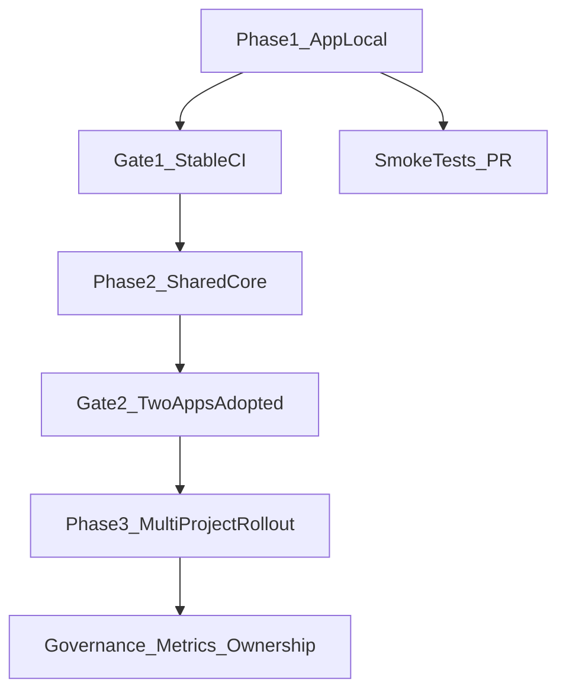

# Playwright Hybrid Rollout Plan

## Objective

Build reliable UI automation with Playwright using a pragmatic hybrid approach:

- Phase 1: app-local setup (fastest value)
- Phase 2: shared automation core extraction
- Phase 3: multi-project rollout and governance

## Phase 1: App-Local Foundation (Start Here)

### Scope

Implement Playwright directly in the current app repo as the first production-quality test suite.

### Deliverables

- Add Playwright project scaffold in app repo (`e2e/`, `playwright.config.ts`, scripts).
- Add smoke tests for your current critical UI flows:
  - OpenAPI upload + generation (bounded operations)
  - Error flow (invalid filters)
  - Basic mode-selection behavior on main page
- Add stable selectors strategy (prefer `data-testid` contract; fallback to IDs already present).
- Add artifacts and diagnostics:
  - screenshots on failure
  - trace/video on retry/failure
  - network response capture for `POST /generate/openapi`
- Add local run commands:
  - headed debug
  - headless CI mode
  - single-test targeting

### Suggested Folder Layout (Phase 1)

- `e2e/tests/` (test specs)
- `e2e/fixtures/` (small deterministic test inputs)
- `e2e/helpers/` (page objects + API/assertion helpers)
- `e2e/reports/` (generated artifacts)

### CI Integration (Phase 1)

- Add a dedicated CI job for E2E smoke tests.
- Start app service in CI before tests.
- Keep Phase 1 suite small (5-12 tests) to ensure fast feedback.

### Exit Criteria for Phase 1

- Tests pass reliably (target >=95% pass over 20 consecutive CI runs).
- Failures include actionable artifacts (trace/screenshot/logs).
- Runtime budget acceptable (e.g., smoke suite <=10 min).

## Phase 2: Extract Shared Automation Core

### Trigger

Start only after Phase 1 stabilizes and at least one additional app needs similar browser test patterns.

### Scope

Create a separate reusable automation-core package/repo that app suites can consume.

### Deliverables

- Shared package/repo with reusable modules:
  - browser/test config presets
  - auth/session helpers
  - retry/wait utilities
  - network capture/report helpers
  - baseline reporter and artifact conventions
- Versioning and release approach (semver tags).
- Reference adapter in current app repo to consume shared core.

### Boundary Rules

- Keep domain-specific selectors/assertions inside each app repo.
- Move only true cross-app utilities into shared core.

### Exit Criteria for Phase 2

- Current app suite runs against shared core with no regression.
- One additional app adopts shared core successfully.

## Phase 3: Multi-Project Rollout and Governance

### Scope

Scale the model across multiple projects under Cursor with consistency and maintainability.

### Deliverables

- Standard template for new app onboarding:
  - minimal app-level test skeleton
  - required scripts and CI job template
- Test taxonomy policy:
  - smoke (PR-gate)
  - regression (scheduled/nightly)
- Ownership model:
  - app team owns app selectors/assertions
  - platform QA/automation owner maintains shared core
- Metrics dashboard/reporting:
  - pass rate
  - flaky test rate
  - median run time

### Exit Criteria for Phase 3

- At least 3 projects onboarded with shared-core + app-local tests.
- Flaky test rate below agreed threshold (e.g., <2%).

## Execution Sequence

1. Implement Phase 1 in current app repo.
2. Stabilize with CI and collect 2-4 weeks of reliability data.
3. Extract shared core in Phase 2 based on actual reuse points.
4. Onboard additional projects using Phase 3 standards.

## Risks and Mitigations

- Over-engineering too early: defer shared-core extraction until stability/reuse signals exist.
- Selector fragility: enforce stable selector contract (`data-testid`) in UI.
- Long runtimes: keep PR suite smoke-only; move deep coverage to nightly.

## High-Level Flow

